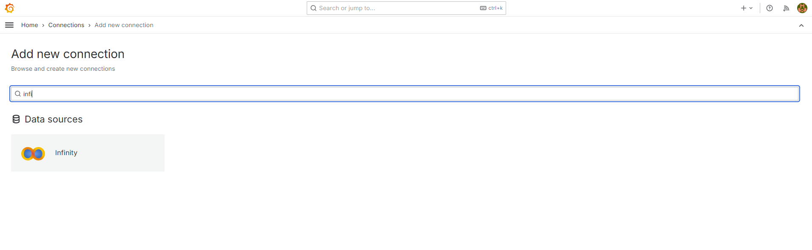
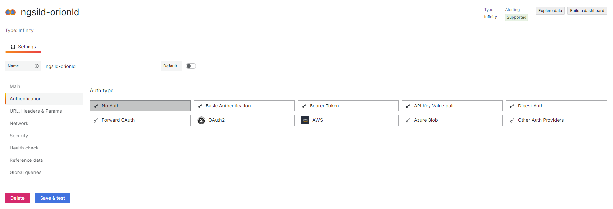
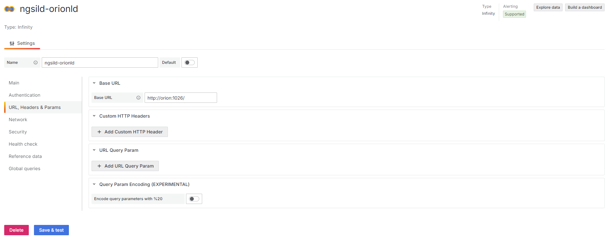
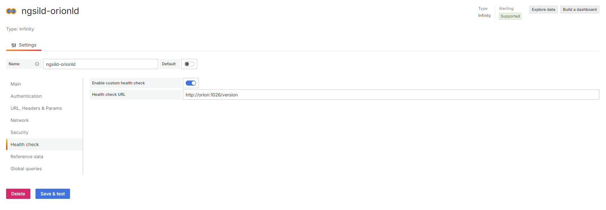
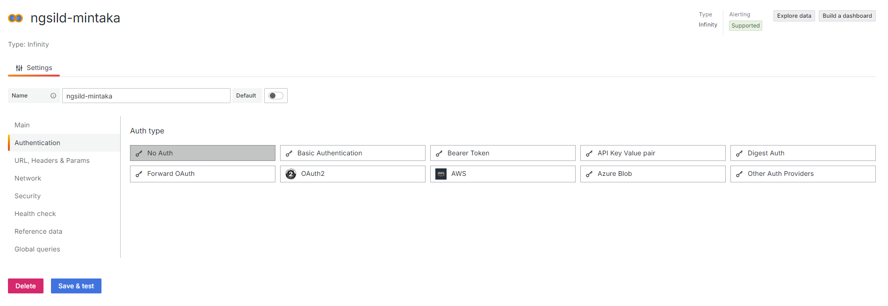
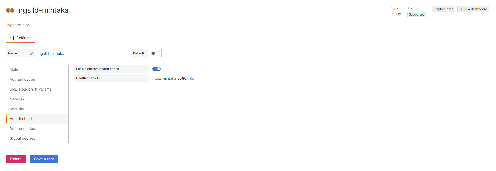
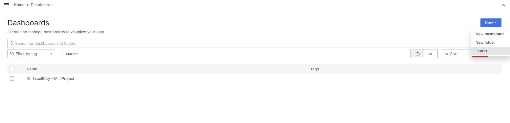
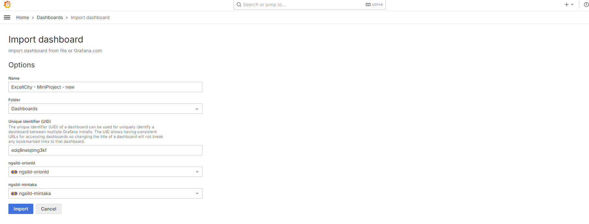
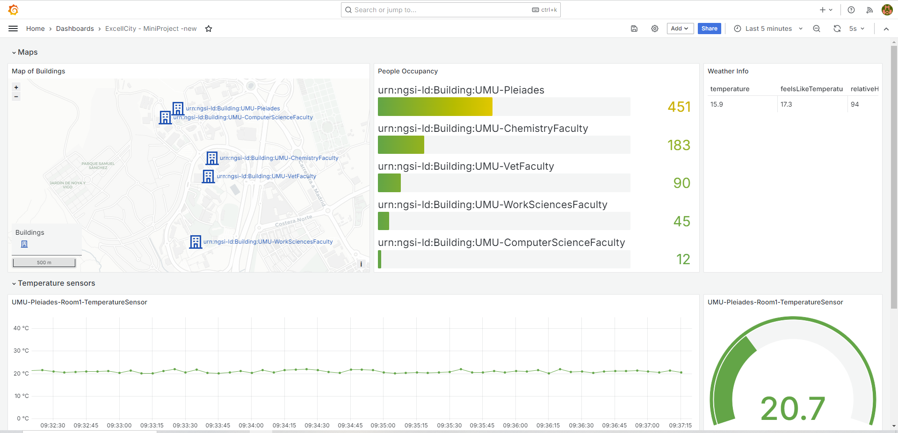

# Grafana Setup Guide

This guide provides clear instructions to help you configure Grafana in your environment, step by step.

## Table of Contents

1. [Accessing the Grafana Web Interface](#accessing-the-grafana-web-interface)
2. [Installing the JSON Plugin](#installing-the-json-plugin)
3. [Adding Data Sources](#adding-data-sources)
   - [Connecting to Orion-LD](#connecting-to-orion-ld)
   - [Connecting to Mintaka](#connecting-to-mintaka)
3. [Importing the Dashboard](#importing-the-dashboard)
---

## Accessing the Grafana Web Interface

To begin configuring Grafana, follow these steps:

1. Ensure that the Grafana environment has already been deployed.
2. Open a web browser and navigate to [http://localhost:3001](http://localhost:3001).
3. Log in using the default credentials:
   - **Username**: `admin`
   - **Password**: `admin`
4. You will be prompted to change the password on first login. Choose a strong password to ensure security.

## Installing the Infinity JSON Plugin

To extend Grafana's capabilities and allow JSON requests:

1. Once logged in, navigate to the **Connections** tab.
2. Click on **Add a new connection**.
3. Search for the **Infinity** plugin (refer to the image in Step 1 if needed).
4. Click **Install** to proceed.

This plugin will enable you to interact with different data formats and is essential for further configuration.

## Adding Data Sources

After installing the necessary plugin, proceed to add the data sources that will connect Grafana to Orion-LD and Mintaka.

### Connecting to Orion-LD

1. Navigate to the **Data Sources** section.
2. Click **Add data source**.
3. Select the appropriate data source type (Infinity) that corresponds with JSON-LD API.
4. Fill in the necessary details, such as:
   - **URL**: The endpoint URL for Orion-LD.
   - **Authentication**: No Auth
   
5. Click Save.

Screenshots:

### Connecting to Mintaka

1. Again, in the **Data Sources** section, click **Add data source**.
2. Select the data source type suitable for Mintaka (Infinity).
3. Provide the required settings:
    - **URL**: The endpoint URL Mintaka.
   - **Authentication**: No Auth
4. Click Save.

Screenshots:

--

--

---

Feel free to let me know if you need any further guidance or if there are additional sections you would like to add!

## Importing the Dashboard

Once you have set up your data sources, the final step is to import the Grafana dashboard to visualize your data.

### Step 1: Import the Dashboard JSON File

1. Navigate to the **Dashboards** tab in the left-hand menu.
2. Click on **New**, then select **Import**.
3. Locate the JSON file included in your project: `grafana/grafana-dashboards/ExcellCity-MiniProject-dashboard.json`.

This file will automatically import a pre-configured dashboard to visualize data from Orion-LD and Mintaka.

### Step 2: Select Data Sources

1. After importing, you will be prompted to select data sources.
2. Choose the data sources you created earlier (Orion-LD and Mintaka).

### Step 3: Import and Visualize

1. Click **Import** to complete the process.
2. Once the import is successful, you will be able to see your data visualized through various panels and charts.

Screenshots for each step are provided below:

--

--

---

This final step will help you get the complete visualization experience, allowing you to see all the information you need at a glance. Let me know if there are any other features or settings you'd like to explore!

