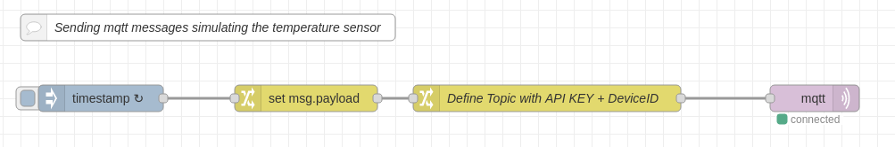
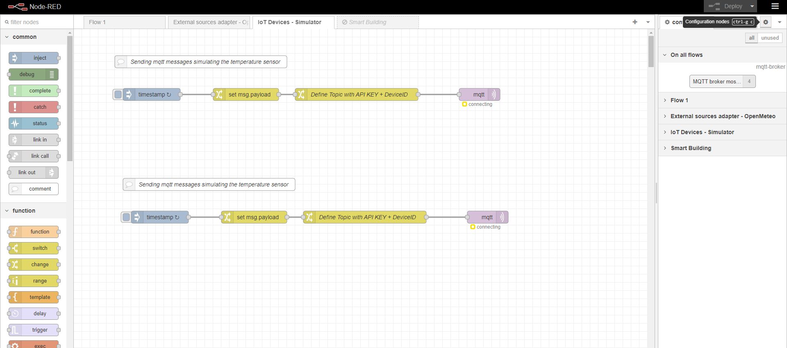
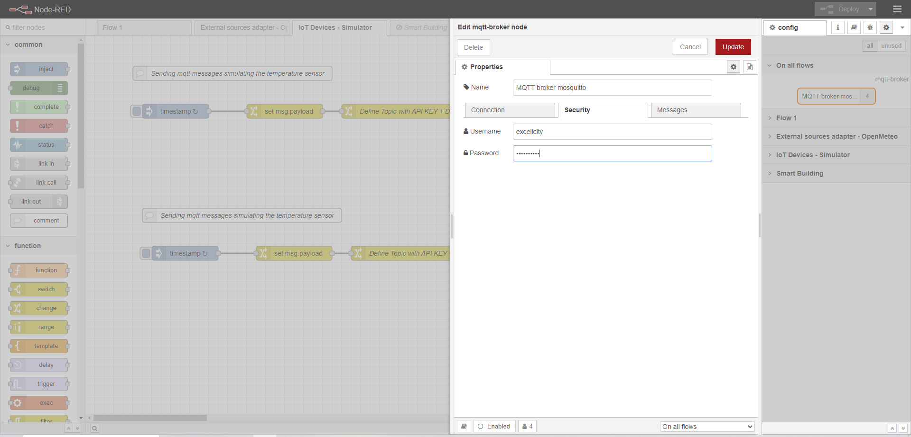

# Guide to Provisioning an IoT Device with MQTT using IoT Agent

## IoT Agent Configuration

The images provided show the configuration of the IoT Agent, indicating values such as the MQTT broker's host (which is located within the Docker network "fiware-deployment" with the hostname "mosquitto") and the NGSI-LD broker it points to ("orion" as hostname). This configuration can be found in the `docker-compose.yml` file and the `.env` file.

## Creating the Service Group

Invoking a service group provision is always the first step when connecting devices. For MQTT communication, provisioning provides the authentication key, so the IoT Agent knows which topic it must subscribe to.

It is also possible to set up default commands and attributes for all devices, but this is not covered in this tutorial since each device will be provisioned separately.

This example provisions a group of devices. It informs the IoT Agent that a series of devices will communicate by sending messages to the `/test` topic.

The `resource` attribute is left blank since HTTP communication is not used (we are using MQTT protocol). It is important to include the `Link` header with the context being used, which in this case points to the context utilized in this project. The `cbroker` URL is an optional attribute. If not provided, the IoT Agent uses the default context broker URL defined in its configuration file. However, it is added here for completeness.

```bash
curl --location 'http://localhost:4041/iot/services' \
--header 'fiware-service: excellcity' \
--header 'fiware-servicepath: /' \
--header 'Content-Type: application/json' \
--header 'Link: <http://context:80/context.jsonld>; rel="http://www.w3.org/ns/json-ld#context"; type="application/ld+json"' \
--data '{
    "services": [
        {
            "apikey":      "test",
            "cbroker":     "http://orion:1026",
            "entity_type": "Device",
            "resource":    "/iot/json",
            "autoprovision" : false
        }
    ]
}'
```

## Provisioning a Sensor

It is a best practice to use URNs following the NGSI-LD specification when creating entities. Additionally, using meaningful names for data attributes makes them easier to understand. These mappings can be defined when provisioning a device individually.

Three types of measurement attributes can be provisioned:

- **Attributes**: These are active readings from the device.
- **Lazy Attributes**: These are only sent upon request. The IoT Agent will inform the device to return the measurement.
- **Static Attributes**: These represent static data about the device (such as relationships) and are sent to the context broker.

The device created will point to an existing entity in the context broker, specifically the entity `urn:ngsi-ld:Device:UMU-Pleiades-Room1-TemperatureSensor`. This entity will be updated, particularly the `value` attribute. Therefore, only dynamic attributes are included in this provisioning, which represent the data reported via MQTT.

> Note: If individual device IDs are not required or aggregated data is sufficient, attributes can be defined within the service provisioning rather than individually.

The following command provisions a sensor:

```bash
curl --location 'http://localhost:4041/iot/devices' \
--header 'fiware-service: excellcity' \
--header 'fiware-servicepath: /' \
--header 'Content-Type: application/json' \
--header 'Link: <http://context:80/context.jsonld>; rel="http://www.w3.org/ns/json-ld#context"; type="application/ld+json"' \
--data '{
    "devices": [
        {
            "device_id": "device1",
            "entity_name": "urn:ngsi-ld:Device:UMU-Pleiades-Room1-TemperatureSensor",
            "entity_type": "Device",
            "protocol": "MQTT_JSON",
            "transport": "MQTT",
            "timestamp": true,
            "apikey": "test",
            "attributes": [
                {
                    "object_id": "t",
                    "name": "value",
                    "type": "Property",
                    "metadata": {
                        "unitCode": {
                            "type": "Text",
                            "value": "CEL"
                        }
                    }
                }
            ],
            "static_attributes": []
        }
    ]
}'
```

In the example above, the body of the POST request includes details such as:

- **Protocol and Transport**: The `protocol` is set to `MQTT_JSON`, and the `transport` is `MQTT`, which indicates that the device will communicate via MQTT using JSON format.
- **Entity Type**: The `entity_type` is set to `"Device"`, which means that the provisioned entity is categorized as a device.
- **Dynamic Attributes**: The `attributes` array contains dynamic data, specifically the `"value"` attribute which represents the current reading of the sensor. This attribute includes metadata such as the `unitCode` to indicate the units being used, in this case, `"CEL"` for Celsius.

The addition of the transport=MQTT attribute in the body of the request is sufficient to tell the IoT Agent that it should subscribe to the **/*****\<api-key>*****/\<device-id>** topic to receive measurements

To simulate the sensor sending MQTT messages with the measurement data, we will use the topic formatted as `/<api-key>/<device-id>`. Specifically, in this example, the topic will be `/test/device1/attrs`. To automate this process, we will use a Node-RED flow that will generate and send the measurements periodically, ensuring continuous data updates from the sensor.




### MQTT Node Configuration in Node-RED

If the MQTT configuration node in Node-RED is not already configured, it is necessary to set up the username and password (excellcity/excellcity) as shown in the following image:





Ensure that you correctly configure the MQTT broker details by including the **username** and **password** fields, as seen in the image. This is important if your MQTT broker requires authentication, which is common in secured deployments. Failing to set these parameters correctly may prevent the device from connecting and sending data.


This guide is based on the FIWARE tutorial available at [FIWARE IoT over MQTT](https://github.com/FIWARE/tutorials.IoT-over-MQTT/tree/NGSI-LD). For more detailed information, please refer to the official documentation:

- [IoT Agent Node Library Documentation](https://iotagent-node-lib.readthedocs.io/en/latest/)
- [FIWARE IoT Agent JSON Documentation](https://fiware-iotagent-json.readthedocs.io/en/latest/)

This guide covers the basics of configuring and provisioning an IoT device with MQTT using an IoT Agent. For further customization and use cases, more configurations and commands may be needed.
