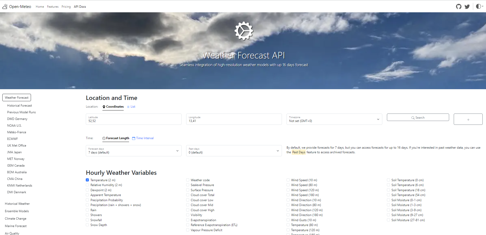
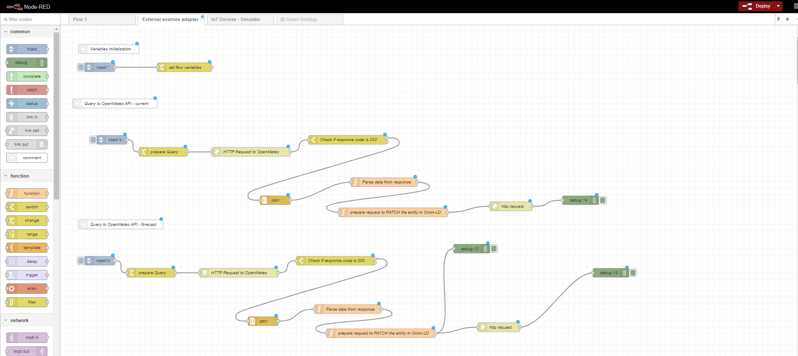

# Integration of External Data to NGSI-LD Broker

## Introduction
This integration aims to gather real-time meteorological data and weather forecast information for the next hour using the [Open-Meteo API](https://open-meteo.com/). The obtained data will be injected into an NGSI-LD Context Broker (Orion-LD), specifically to update `WeatherObserved` and `WeatherForecast` entities.

## Open-Meteo API Overview
Below is a snapshot of the Open-Meteo API portal, showing the available weather services and the structure of the API.



## Example API Request and Response
We are using the following `curl` request to retrieve weather data from Open-Meteo API:

```bash
curl --location 'https://api.open-meteo.com/v1/forecast?latitude=38.02112781484165&longitude=-1.1730213136053926&current=temperature_2m%2Crelative_humidity_2m%2Capparent_temperature%2Cprecipitation&timezone=GMT&forecast_days=1'
```

### Example Response
```json

{
    "latitude": 38.0,
    "longitude": -1.1875,
    "generationtime_ms": 0.055909156799316406,
    "utc_offset_seconds": 0,
    "timezone": "GMT",
    "timezone_abbreviation": "GMT",
    "elevation": 111.0,
    "current_units": {
        "time": "iso8601",
        "interval": "seconds",
        "temperature_2m": "°C",
        "relative_humidity_2m": "%",
        "apparent_temperature": "°C",
        "precipitation": "mm"
    },
    "current": {
        "time": "2024-10-24T11:15",
        "interval": 900,
        "temperature_2m": 22.0,
        "relative_humidity_2m": 61,
        "apparent_temperature": 23.1,
        "precipitation": 0.00
    }
}
```

## Node-RED Flow as Adapter
To implement the integration, a Node-RED flow is used to act as an adapter. This flow transforms the response from the Open-Meteo API and injects it into the Orion-LD Context Broker as NGSI-LD entities.

Below is a snapshot of the Node-RED flow:



## Example of Updated Entities after Flow Execution
After running the Node-RED flow, the `WeatherObserved` and `WeatherForecast` entities are updated as follows:

### WeatherObserved
```jsonld

{
    "id": "urn:ngsi-ld:WeatherObserved:Murcia-UMU-CampusEspinardo",
    "type": "WeatherObserved",
    "address": {
        "type": "Property",
        "value": {
            "addressLocality": "Murcia",
            "postalCode": "30100",
            "streetAddress": "Campus de Espinardo"
        }
    },
    "dateObserved": {
        "type": "Property",
        "value": "2024-10-24T11:15:00.000Z"
    },
    "location": {
        "type": "GeoProperty",
        "value": {
            "type": "Point",
            "coordinates": [
                -1.172887,
                38.024485
            ]
        }
    },
    "temperature": {
        "type": "Property",
        "value": 22,
        "observedAt": "2024-10-24T11:15:00.000Z"
    },
    "feelsLikeTemperature": {
        "type": "Property",
        "value": 23.1,
        "observedAt": "2024-10-24T11:15:00.000Z"
    },
    "relativeHumidity": {
        "type": "Property",
        "value": 61,
        "observedAt": "2024-10-24T11:15:00.000Z"
    },
    "precipitation": {
        "type": "Property",
        "value": 0,
        "observedAt": "2024-10-24T11:15:00.000Z"
    },
    "source": {
        "type": "Property",
        "value": "https://open-meteo.com/"
    },
    "dataProvider": {
        "type": "Property",
        "value": "Open-Meteo"
    }
}
```

### WeatherForecast
```jsonld
{
    "id": "urn:ngsi-ld:WeatherForecast:Murcia-UMU-CampusEspinardo",
    "type": "WeatherForecast",
    "address": {
        "type": "Property",
        "value": {
            "addressLocality": "Murcia",
            "postalCode": "30100",
            "streetAddress": "Campus de Espinardo"
        }
    },
    "dataProvider": {
        "type": "Property",
        "value": "Open-Meteo"
    },
    "dayMaximum": {
        "type": "Property",
        "value": {
            "temperature": 23.9,
            "feelsLikeTemperature": 24.1
        }
    },
    "dayMinimum": {
        "type": "Property",
        "value": {
            "temperature": 15.8,
            "feelsLikeTemperature": 17
        }
    },
    "feelsLikeTemperature": {
        "type": "Property",
        "value": 23.7
    },
    "temperature": {
        "type": "Property",
        "value": 22.7
    },
    "relativeHumidity": {
        "type": "Property",
        "value": 59
    },
    "precipitationProbability": {
        "type": "Property",
        "value": 0
    },
    "source": {
        "type": "Property",
        "value": "https://open-meteo.com/"
    },
    "validFrom": {
        "type": "Property",
        "value": "2024-10-24T12:00:00.000Z"
    },
    "validTo": {
        "type": "Property",
        "value": "2024-10-24T13:00:00.000Z"
    }
}

```

## Summary
This integration uses Node-RED flow as an adapter to facilitate the transformation and injection of external meteorological data from Open-Meteo into the Orion-LD Context Broker, ensuring the availability of real-time weather data and forecasts in NGSI-LD format.

The flow where all this is developed is named "External sources adapter - OpenMeteo".

