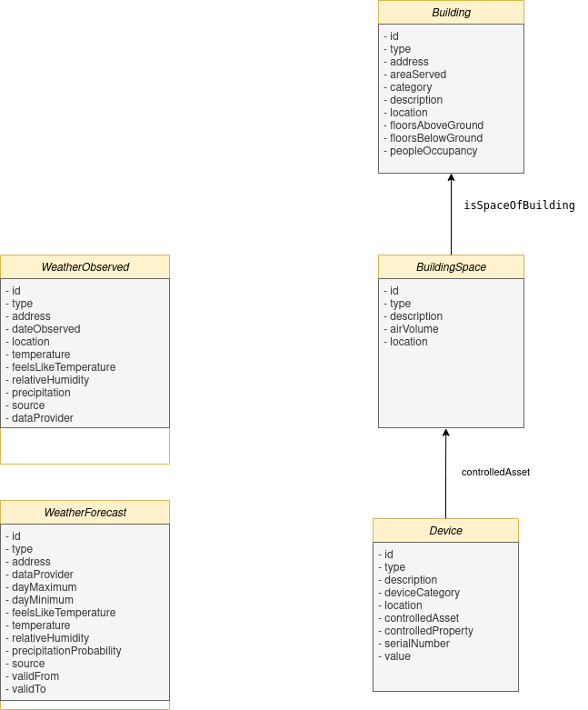

# MiniProject powered by FIWARE

Welcome to the MiniProject powered by FIWARE. This project is aimed at showcasing the use of FIWARE components to create a smart environment involving IoT, linked data, and integration of external APIs.

This MiniProject powered by FIWARE is an educational project designed to help users learn about FIWARE environments by leveraging the technologies, protocols, and solutions it offers. It is focused on a Smart City scenario involving buildings, sensors, actuators, and more. Keep in mind that this is a small-scale development scenario aimed at learning and getting started in the world of FIWARE.

The project involves setting up an intelligent scenario using various FIWARE components. The project is deployed using Docker Compose, and the scenario includes multiple IoT devices simulated through MQTT, with data integration handled by Node-RED.

Follow the detailed steps in the provided readme files to deploy and configure the environment, initialize the scenario, and enable the integration of IoT and external data sources.

If you have any questions or need further assistance, please feel free to reach out!


##  Overview

This document provides an overview of the architecture, data models, and steps to get started with deploying and configuring the scenario locally.

The project architecture consists of several FIWARE services deployed using Docker and Docker Compose. Below, you will find an illustration of the project architecture and the data model diagram.

### Architecture Diagram

<p align="center">
  
</p>

- **Grafana**: Used for visualization and monitoring of time-series data, allowing dashboards to be built for the analysis of IoT data.
- **Orion-LD** (Context Broker): Manages context information and handles NGSI-LD queries and subscriptions.
- **IoT-Agent** (JSON): Manages the communication with IoT devices using the JSON protocol and MQTT.
- **MongoDB**: Stores context data for Orion-LD and IoT-Agent. (2 different databases but same instance)
- **TimescaleDB**: Handles time-series data for analytics.
- **Mintaka**: Handles temporal queries of NGSI-LD data.
- **Node-RED**: Handles external API integrations, such as fetching weather data and simulating IoT devices reporting via MQTT.
- **Mosquitto**: MQTT broker for managing IoT device messages.
- **Apache HTTP Server**: Serves the `context.jsonld` file for linked data.

### Data Model Diagram

<p align="center">
  
</p>
The data model diagram provides an overview of the entities used in this project, such as **Building**, **BuildingSpace**, and **Device**. These entities are essential for setting up the scenario and have various attributes used in managing smart environment functionalities.

## Technical Overview

This section will guide you through the technical steps involved in deploying and configuring the project.

### 1. Entity Directory for Scenario Initialization

All entity data used to initialize the scenario can be found in the following directory:

```
/import-data
```

This directory contains JSON files such as `buildings.json`, `buildingspaces.json`, and `devices.json`, which are used to define the entities in the scenario. These entities include static attributes that are required for the simulation.

### 2. Deploying the Scenario Using Docker and Docker Compose

To deploy the scenario using Docker and Docker Compose, please follow the instructions provided in the deployment readme:

[Deployment README](README-local-deployment.md)

The `deploy.sh` script is designed to automate the setup of FIWARE services, including Orion-LD, IoT-Agent, MongoDB, TimescaleDB, Mintaka, Node-RED, Mosquitto, Apache, and Grafana.

### 3. Setup the Integration Components (NodeRED and Iot Agent JSON)

Once the scenario is initialized with the static entity data (such as **Building**, **BuildingSpace**, and **Device**), the next step is to configure the integration layer. This involves setting up the **IoT-Agent JSON** for managing MQTT devices and configuring **Node-RED** flows for integration with external APIs.

For more information on configuring the integration layer, please refer to the following readme:

[Integration Configuration README](README-setup-iotagent.md)

This README will guide you through setting up Node-RED flows and configuring the IoT-Agent JSON to communicate with IoT devices via MQTT, as well as integrating external data sources such as weather APIs.

Important note: The device provisioning process is manual. If you want to start viewing data reports, you need to provision each device individually. The respective requests for this process can also be found in the provided Postman collection.

## TODO
- incluir creacion de red docker
- documentar integracion weatheer api con NodeRED
- documentar grafana y adjuntar fichero del dashboard
- incluir fichero JSON con colleccion de postman
- incluir fichero JSON con flujos NODE-RED